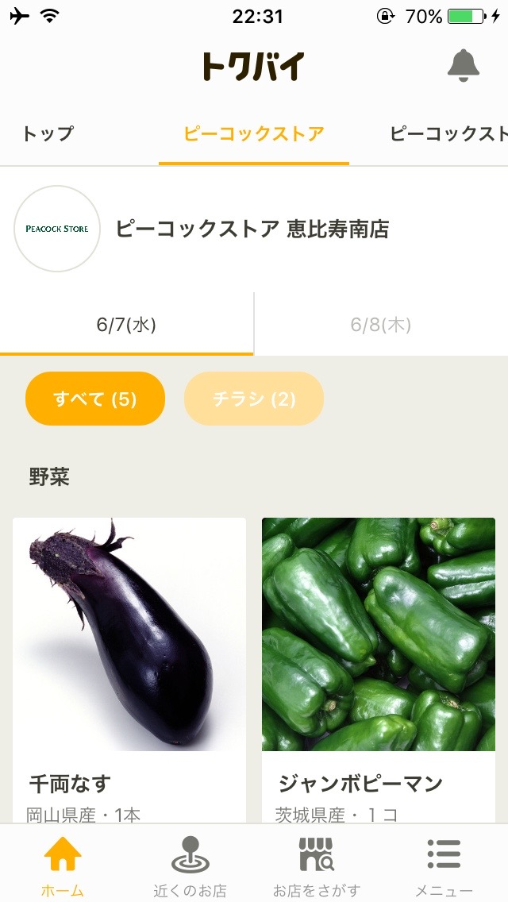
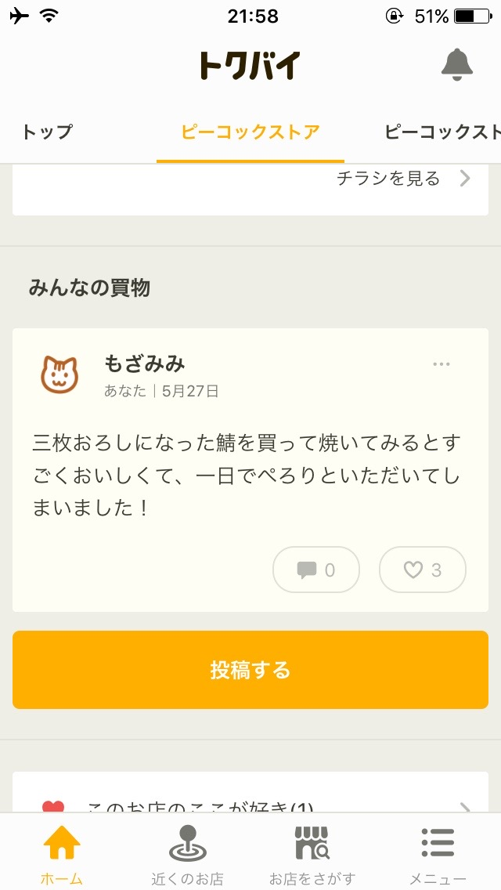
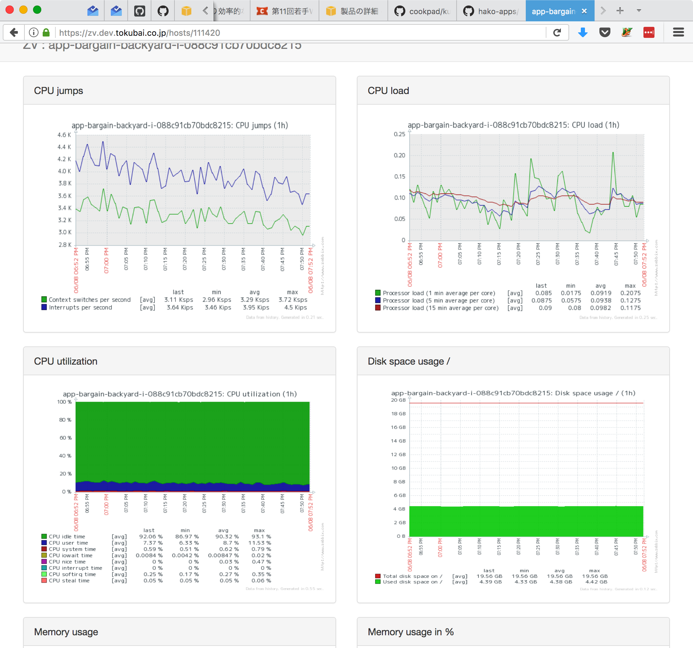
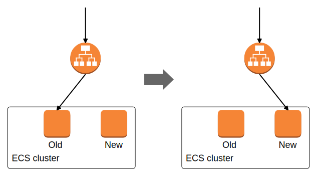
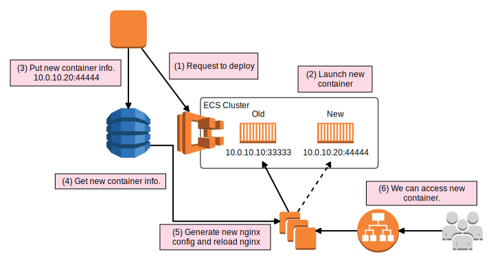

## confd を使った節約内製

## アプリデプロイシステム

<p style="text-align: right;">
SRE Group / Cookpad Inc. <br>
@mozamimy
</p>

Note: ここまで 0.5m

---

## 🐰誰?


```sql
select * from rabbits where id = 'mozamimy'\G
```

```
*************************** 1. row ***************************
               id: mozamimy
          twitter: @mozamimy
     mail_address: alice@mozami.me
         web_site: https://mozami.me/
       working_on: Cookpad Inc.
        job_title: Site Reliability Engineer
   responsibility: エンジニアリングでインフラの運用をいい感じにする
           ᕱ⑅ᕱ ♡: AWS / Linux / Ruby / Rust / Vim
1 row in set (0.00 sec)
```

Note: ここまで 1.0m

---





Note: 
- 近所の小売店の特売情報がばんばん入ってくるサービス
  - ブラウザ・モバイルアプリからアクセス可能
  - チラシも見られる
- 現在は独立
  - 去年まではクックパッド内にあった
- クックパッドともに学生時代から愛用🐰

---

## 昨年: トクバイチームごと分社化

---

## コードベースも分離!

---

## もちろんインフラも分離!

---

## 分離 とは

- 📝 アプリを分離する
  - Rails モノリスからトクバイ関係のコードを切り出していく
  - アプリエンジニアががんばる
- 💻 **インフラを分離する**
  - **トクバイ用の AWS アカウントに移す**
  - **アプリサーバ・ミドルウェア・開発基盤 etc...**

Note: ここまで 2m

---

## 💪 やるだけ 💪

Note: エンジニアの好きな言葉「やるだけ」。アプリの切り出しはモノリスだし強烈だけど、インフラはやるだけでは?

---

## 🤔 ほんまか? 🤔

---

## 🗯 やるだけではない

- サービスを落とさないように慎重にかつ大胆に
- **トクバイチームにフィットしたインフラにしたい**

Note: もちろん SRE としてサイトを落とさないように慎重にかつ大胆に.. そして大事なのは、「トクバイチームにフィットしたインフラにしたい」ということです。

---

## Cookpad Way を継承しつつ

## Tokubai Way でやっていく

<p style="text-align: right;">
を象徴する技術的な話をします<br>
ｳｪ~ｲ
</p>

---

## confd を使った節約内製

## アプリデプロイシステム

---

## 💻アプリを動かす基盤

- **Cookpad Way**
  - Amazon ECS (EC2 Container Service) を利用
  - デプロイには eagletmt/hako を利用
- **Tokubai Way**
  - confd & reload-rproxy-internal を使ったデプロイシステム

---

## 🐳Amazon ECS とは

- Docker 化されたアプリを EC2 クラスタにデプロイできるサービス
- いい感じに EC2 インスタンスにアプリを配置してくれる

---

## 📦eagletmt/hako とは

- ECS の API をたたいてアプリをデプロイできるツール
  - https://github.com/eagletmt/hako
- YAML で設定を書ける
  - docker-compose を想像するとピンとくるかも
- rollback や oneshot といった機能が充実
- プラグイン機構で機能を拡張可能

---

## 📦内製アプリ例



---

## ECS & ELB による切り替え

- アプリ専用の ELB (or ALB) を使う構成が主流
- ECS が面倒を見てくれる



---

## 内製アプリ 1 コ 1 コに

## 専用 ELB を使う？

---

# It's MOTTAINAI! 🤑

---

## システムで解決💪

## confd 💕 reload-rproxy-internal

---

## confd

- https://github.com/kelseyhightower/confd
- バックエンドの変更を検知
  - テンプレートから設定ファイルの生成
  - 任意のコマンドを実行
- バックエンド
  - DynamoDB (KVS)・etcd・consul など
- 動的に生成した設定で nginx を reload できる

---

## なぜ confd？

- クックパッドにも ELB を共用するシステムはある
- ただし consul を利用
  - トクバイチームにとってはオーバーキル
  - consul 運用したくないんじゃぁ〜
- DynamoDB でサーバーレスで happy ✨

---

## reload-rproxy-internal とは

- hako の プラグインとして実装
- デプロイ先のコンテナの情報を DynamoDB に格納
  - IP アドレス
  - ポート
  - デプロイ時刻 (UNIX time)
- 実はステージング環境でも利用

---



---

## 改善点

- 2 コンテナ以上起動する場合には使えない
  - プロダクションで使うなら必須
  - プロダクションなら専用 ELB 使うかなぁ..
- NON-FREE SOFTWARE
  - そのうち OSS にします😤

---

## まとめ

- 同じ目的を達成するにも方法は様々
- チーム・組織に合わせたインフラを構築すべし
- みなさんこれからどうぞよろしくお願いします🙌

---

## ボツスライド

---

## 📦hako を使ったデプロイ

- コマンドひとつでデプロイ・ロールバックできる
- プロダクションでも hako を利用
- Kuroko2 というバッチシステム上で hako コマンドをたたく
- チャットボット (ruboty) からもデプロイ可能

```
$ hako deploy zv.yml
$ hako rollback zv.yml
$ hako dry-run zv.yml
```
---

# 突然ですが

---

## 「クックパッド」を

## ご存知ですか？

---

## 「トクバイ」を

## ご存知ですか？

---

## nginx の設定テンプレート

```nginx
server {
  listen 80;
  server_name zv.dev.tokubai.co.jp;

  # 中略

  location / {

    # 中略

    set $endpoint {{ getv "/ecs/internal/zv/host" }};
    set $port {{ getv "/ecs/internal/zv/port" }};
    proxy_pass http://$endpoint:$port;
    include /etc/nginx/conf.d/includes/default_proxy_headers.conf;
  }
}
```
