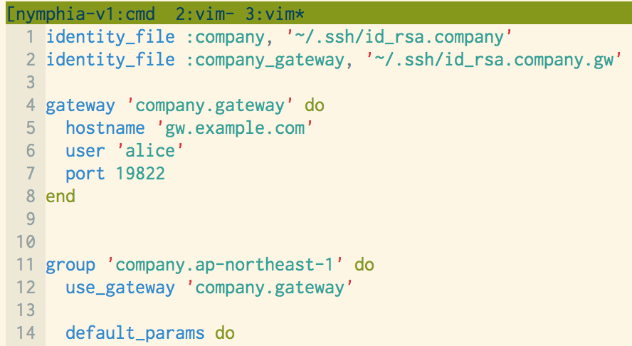

<!-- $theme: gaia -->

# Ruby DSL :gem: × SSH config :page_with_curl: = Nymphia !!

## [@mozamimy](https://mozami.me/)

## 

---
<!-- page_number: true -->

# :rabbit2: 誰?

```sql
select * from rabbits where id = 'mozamimy'\G
```

```
*************************** 1. row ***************************
               id: mozamimy
          twitter: @mozamimy
     mail_address: alice@mozami.me
         web_site: https://mozami.me/
       working_on: Cookpad Inc.
        job_title: Site Reliability Engineer
   responsibility: インフラをいい感じにする
           ᕱ⑅ᕱ ♡: AWS / Linux / Ruby / Rust / Vim
1 row in set (0.00 sec)
```

---
<!-- page_number: true -->

## [@mozamimy](https://mozami.me/)

## 

---
<!-- page_number: true -->

# お題 (3行で)

- SSH config に秩序を取り戻すために
- Ruby DSL の力を使う
- Nymphia というツールを作った
  - https://github.com/mozamimy/nymphia

---
<!-- page_number: true -->

# Ruby DSL の利点

- 設定ファイルを構造化できる
- 冗長な記述を減らせる
- 動的な設定
  - AWS の API で得た情報をもとに設定を作る
- Ruby に慣れてるので書きやすい

---
<!-- page_number: true -->

# 雑になりがちな SSH config も

# Ruby で書けたら

# 便利なのでは?!

---
<!-- page_number: true -->

# :scream: SSH config

```
Host alice
  Hostname alice.example.com
  User alice
  Port 4321
  IdentityFile ~/.ssh/id_rsa.1
  
Host whiterabbit
  Hostname whiterabbit.example.com
  User whiterabbit
  Port 54321
  IdentityFile ~/.ssh/id_rsa.2
```

- このような記述が数百行ひたすら 1 ファイルに　 :soon: 地獄
- 人の config も読めたものではない

---
<!-- page_number: true -->

# 

---
<!-- page_number: true -->

# Nymphia

# https://github.com/mozamimy/nymphia

---
<!-- page_number: true -->

# :question: Nymphia #とは

```ruby
identity_file :private, '~/.ssh/id_rsa.1'

my_server_port = 4321

host 'alice', 'my server on VPS' do
  hostname 'alice.example.com'
  user 'alice'
  port my_server_port
  use_identify_file :private
end
```

```
Host alice
  Hostname alice.example.com
  User alice
  Port 4321
  IdentityFile ~/.ssh/id_rsa.1
```

---
<!-- page_number: true -->

# :gem: Install

```sh
$ gem install nymphia
```

# :pencil2: CLI

```sh
$ nymphia --help
nymphia
    -f, --file=FILE         Your DSL code file
    -o, --output=FILE       Output file (default: stdout)
```

___
<!-- page_number: true -->

# :pencil: ビムにやさしい!

https://github.com/mozamimy/nymphia.vim



---
<!-- page_number: true -->

# :thought_balloon: 使い方 (雰囲気)

時間がないので一部だけ

- `host`: キホン
- 冗長な記述を減らすワザ
  - `group` と `gateway` のあわせワザ

---
<!-- page_number: true -->

# :rabbit: キホン

## :memo: source

```ruby
identity_file :private, '~/.ssh/id_rsa.1'

my_server_port = 4321

host 'alice', 'my server on VPS' do
  hostname 'alice.example.com'
  user 'alice'
  port my_server_port
  use_identify_file :private
end
```

---
<!-- page_number: true -->

# :rabbit: キホン

## :memo: compiled

```plain
#
# This config is generated by Nymphia 0.1.1
#

# my server on VPS
Host alice
  Hostname alice.example.com
  User alice
  Port 4321
  IdentityFile ~/.ssh/id_rsa.1
```

---
<!-- page_number: true -->

# :customs: Gateway 

## Gateway を定義

```ruby
gateway 'company.gateway' do
  hostname 'gw.example.com'
  user 'alice'
  port 19822
  use_identity_file :company_gateway
end
```

- `host` の代わりに `gateway` でゲートウェイを定義
- ブロック内は普通の `host` とおなじ

---
<!-- page_number: true -->

# :customs: グループと Gateway

- グループで複数の `host` をまとめられる
- グループ内のホストにゲートウェイをまとめて指定できる
- ホストに設定するデフォルトのパラメータを指定できる

---
<!-- page_number: true -->

```
group 'company.ap-northeast-1' do
  use_gateway 'company.gateway'

  default_params do
    check_host_ip 'no'
    strict_host_key_checking 'no'
    user 'alice'
    port 9822
    use_identify_file :company, :company_gateway
  end

  host '*.apne.aws.example.com'

  host 'alice.apne.aws.example.com' do
    hostname '10.16.16.16'
    user 'white_rabbit'
    port 7777
  end
end
```

---
<!-- page_number: true -->

# :customs: グループと Gateway

```plain
#
# This config is generated by Nymphia 0.1.1
#

Host company.gateway
  Hostname gw.example.com
  User alice
  Port 19822

Host *.apne.aws.example.com
  CheckHostIp no
  StrictHostKeyChecking no
  User alice
  Port 9822
  IdentityFile ~/.ssh/id_rsa.company
  IdentityFile ~/.ssh/id_rsa.company.gw
  ProxyCommand ssh company.gateway -q -W %h:%p
```

---
<!-- page_number: true -->

# :customs: グループと Gateway

```plain
Host alice.apne.aws.example.com
  CheckHostIp no
  StrictHostKeyChecking no
  IdentityFile ~/.ssh/id_rsa.company
  IdentityFile ~/.ssh/id_rsa.company.gw
  ProxyCommand ssh company.gateway -q -W %h:%p
  Hostname 10.16.16.16
  User white_rabbit
  Port 7777
```

---
<!-- page_number: true -->

# :muscle: まとめ

- SSH config を Ruby DSL で書けるようになった
- SSH config に秩序がもたらされた
- さらなる改善
  - SSH config → Ruby への変換 
  - OpenSSH の新機能に対応
    - `ProxyJump` とか `Include` とか..
  - `nymphia ssh` サブコマンド
    - 明示的なコンパイルなしに ssh する

---
<!-- page_number: true -->

# ボツスライド

---
<!-- page_number: true -->

# Infrastructure as Code

- コードでインフラの状態を管理しよう
- AWS のリソースそのもの
  - **Codenize.tools**
    - https://codenize.tools/
  - Terraform・CloudFormation etc...
- サーバの構成管理
  - **Itamae**
  - Chef・Puppet・Ansible etc...

---
<!-- page_number: true -->

# Ruby DSL

Codenize.tools の Roadworker の例

```ruby
hosted_zone "example.com." do
  rrset "example.com.", "A" do
    ttl 300
    resource_records(
      "127.0.0.1",
      "127.0.0.2"
    )
  end
end
```

http://codenize.tools/

---
<!-- page_number: true -->

# :bust_in_silhouette: Proxy

- 手元との開発環境から SSH トンネルでリモートの DB につなぎにいくみたいなパターン
- `host` と基本は同じ
	- ブロック内は `host` と同様に書ける
- `proxy` 内では `local_foward` というメソッドが使える
	- `LocalForward` をハッシュできれいに書ける

---
<!-- page_number: true -->

# :bust_in_silhouette: Proxy

```ruby
identity_file :company_proxy, '~/.ssh/id_rsa.company.gw'

proxy 'awsproxy.company.apne1' do
  hostname 'gw.apne1.example.com'
  user 'alice'
  port 19822
  use_identify_file :company_proxy

  # SOCKS proxy
  dynamic_forward 23921

  # ssh tunnels
  local_forward 'mysql-server', {
    'localhost' => 13306,
    'mysql.apne.aws.example.com' => 3306,
  }
end
```

---
<!-- page_number: true -->

# :bust_in_silhouette: Proxy

## :memo: compiled

```plain
#
# This config is generated by Nymphia 0.1.1
#

Host awsproxy.company.apne1
  Hostname gw.apne1.example.com
  User alice
  Port 19822
  IdentityFile ~/.ssh/id_rsa.company.gw
  DynamicForward 23921
  LocalForward localhost:13306 mysql.apne.aws.example.com:3306
```

---
<!-- page_number: true -->

# :bust_in_silhouette: Gateway & Proxy

- 踏み台を定義するためのメソッド
- `host` と代わりとして使える
- `gateway`
  - ふつうの踏み台
- `proxy`
  - SSH トンネルをはるための踏み台

---
<!-- page_number: true -->

# :hocho: ファイル分割

```ruby
identity_file :private, '~/.ssh/id_rsa.1'

host 'alice', 'my server on VPS' do
  hostname 'alice.example.com'
  user 'alice'
  port 4321
  use_identify_file :private
end

load 'other_nymphia_file.nym.rb'
```

- `load` で別ファイルを読み込める
- 単一の config として出力される

---
<!-- page_number: true -->

# :computer: グループの定義

```ruby
identity_file :private, '~/.ssh/id_rsa.1'

group 'wonderland' do
  host 'alice', 'my server on VPS' do
    hostname 'alice.example.com'
    user 'alice'
    port 4321
    use_identify_file :private
  end
  
  # :
  # :
  # :
  
end

```

---
<!-- page_number: true -->

# :thought_balloon: しんどい!


- ループが使えない
  - 記述が冗長になる
- 変数が使えない
  - あらゆる箇所を直さないといけない
- 他の人のコンフィグが読みづらい